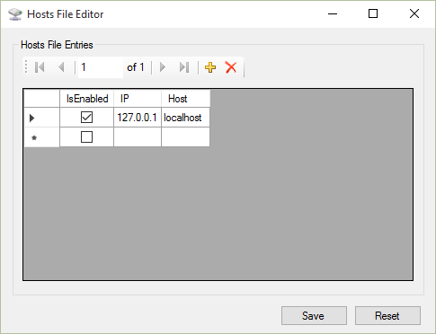

# Hosts File Editor

Yet another dead simple `hosts` file editor for Windows.

## Features

* Modifies security permissions for you
* Does not preserve original comments

## Screenshot

## License

Apache 2.0
